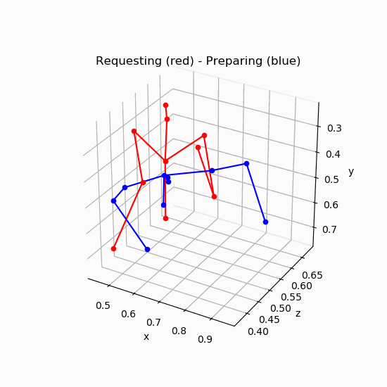

# Multi Users Activities Recognition for Human-Robot Collaboration

This project explores the challenge of gathering data for multi-user interactions in Human-Robot collaboration. By merging the data collected from individual users to produce multi users data, the study aims to simplify the process of dataset creation. Using 3D skeleton poses of activities performed by single users, the project demonstrates the feasibility of training machine learning models, such as LSTM networks and VAEs with STGCNs, to recognize activities of user pairs. The results indicate that this approach achieves comparable performance to training data collected from groups of individual users, offering a promising solution for advancing research in multi-party Human-Robot interaction and collaboration.

## Overview

* [config/](config) includes json files saving the model hyperparameter settings
* [csf/](csf) includes codes to control the CSF3
* [data/](data) includes skeleton data
* [preprocess/](preprocess) includes code to preprocess data
* [visualization/](visualization) includes code for visualizing the data and some visualization

## Data
The data is obtained from the research by [Francesco et al. (2023)](https://ieeexplore.ieee.org/document/10191782). **Single Data** is the recording of one person and **Pair Data** is the recording of two people. In this research, three tasks are defined:

- Working: manipulating the tool at their chest heigh
- Preparing: fetching the new item for the next task from the working table
- Requesting: raising a hand and hold it to request the next task

In **Single Data**, the participant acts all of the three tasks and this recording is merged with other(or same) participant's recordings to generate 9 combinations of label. In **Pair Data**, two participants act 9 combinations in one recording.

Single Data             |  Pair Data
:-------------------------:|:-------------------------:
  |  

## Data Pre-processing
From 32 joints of original skeleton, only 11 joints are selected for this research. Two normalizations are done in the data pre-processing step: **Naval-Neck Normalization** and **Min-Max Normalization**.
Raw Data             |  Normalized Data
:-------------------------:|:-------------------------:
  |  

In case of **Single Data**, it is merged with other or same participant's data so that it generates the same form of **Pair Data**
Single Data             |  Merged Data
:-------------------------:|:-------------------------:
  |  
